# Vetting at Mission Speed

### The Case for a Unified Experience Layer Over the Government's Personnel Security Systems

**A concept white paper and working demonstration**

Prepared by [Teneika Askew](https://www.linkedin.com/in/teneikaaskew) | July 2026

---

## In Brief

- The federal personnel vetting enterprise has spent eight years and several billion dollars pursuing a single replacement system, and the mission is still run across a patchwork of legacy tools. GAO reported in September 2025 that the Department of Defense had spent $2.4 billion on NBIS and the legacy systems it was meant to retire, with $2.2 billion more projected through FY2031 [6].
- Agencies do not have to wait. A **vetting experience layer** - a subject-centric, role-based application that sits on top of existing systems of record and data providers - can deliver the Trusted Workforce 2.0 operating picture now, without displacing a single system of record.
- This paper is grounded in a working product, not a concept deck. **Aegis**, a deployed reference implementation, unifies initiation, investigation, SEAD-4 adjudication, continuous vetting, document provenance, workforce assignment, and analytics over a 12-source data-provider fabric and a corpus of **33,610 real, published DOHA adjudication decisions**. Every screenshot in this paper is the product running.
- The pattern is buildable at startling speed. The reference implementation went from design research to a deployed, tested product - 16 routed views, 240+ automated tests, a deterministic 15-subject dataset, and AI-assisted analysis with human decision authority - in roughly two weeks of iterative delivery.

---

## 1. The Moment: A Reform Stuck Between Two Systems

Personnel vetting is the federal government's system for answering one question: can this person be trusted with the nation's secrets, facilities, and missions? It is also one of the government's largest sustained operational programs. The Defense Counterintelligence and Security Agency (DCSA) conducts about **95 percent of all federal background investigations** - more than **2.7 million investigations completed in FY2024** - and adjudicated roughly **622,000 determinations** in the same year while continuously vetting approximately **4 million** cleared employees and contractors for more than 140 agencies [11][12].

The last decade of this mission has been a story of two reforms running at different speeds.

**The policy reform worked.** Trusted Workforce 2.0, the government-wide overhaul of vetting policy, replaced the old model of point-in-time reinvestigations with continuous vetting: automated record checks that run all the time, against criminal, financial, terrorism, foreign travel, and eligibility data sources. The results are measurable. The investigation backlog that peaked above **710,000 pending cases in early 2018** - the figure GAO used when it added the government-wide personnel security clearance process to its High-Risk List that January - has been worked down to steady-state levels [1][2]. DCSA estimates continuous vetting surfaces problematic behavior roughly **three years earlier for high-risk positions and seven years earlier for moderate-risk positions** than the reinvestigations it replaced [13][20]. The periodic reinvestigation is now functionally gone - requests fell **96 percent in a single year**, from 7,716 in early FY2025 to 337 in the first quarter of FY2026 - and the government's plan calls for the full national security population to be enrolled in continuous vetting by September 2028 [20].

**The technology reform did not keep pace.** The National Background Investigation Services (NBIS) program - the single system intended to carry the entire vetting lifecycle - began in 2016 with full operational capability targeted for 2019. It is still not done [4][5]. The DCSA director told Congress in June 2024: *"We're 8 and a half years into a three-year program. We spent $1.345 billion on about a $700 million dollar program"* [9]. GAO's accounting is broader and starker: **$2.4 billion spent through FY2024** across NBIS development and the legacy systems it has not yet retired, with **$2.2 billion more projected through FY2031 - roughly $4.6 billion total** - and major development now targeted for the end of FY2027, with legacy sunset in FY2028 [6][7].

The February 2026 GAO testimony to the House Oversight Committee summarized where things stand: the program's new cost estimate is finally reliable, but its schedule still is not - no valid critical path, no schedule risk analysis - and timeliness goals were missed in nearly all vetting phases [7]. The government's own quarterly scorecard shows what missing looks like: at the close of FY2025, a Secret-level case took **109 days end to end against a 40-day Trusted Workforce target**, and a Top Secret case took **220 days against a 75-day target** - roughly three times the standard, even as quarter-over-quarter trends improve [20][22]. Meanwhile the process itself has sat on GAO's High-Risk List continuously since January 2018, and was not removed in the February 2025 update [3]. In December 2025, GAO found that **more than 60 percent of the FY2024 clearance data it reviewed was inaccurate or incomplete** [8].

So the operating reality for a security office in 2026 looks like this: policy that assumes a real-time, whole-person operating picture, delivered through a set of systems that were never designed to provide one - eApp for forms (which replaced e-QIP in October 2023), DISS for eligibility and access, DCII for investigative indexes, SWFT for fingerprints, NISS for facilities, agency case tools for everything else - while the unifying system remains years away [7][10].

That gap between what the policy assumes and what the screens actually show is the subject of this paper.

---

## 2. The Stakes, in Numbers

> **$4.6B** - projected total cost of NBIS plus legacy system sustainment through FY2031 (GAO) [6]
>
> **8.5 years into a 3-year program** - DCSA director to Congress on NBIS, June 2024 [9]
>
> **60%+** - share of FY2024 clearance records GAO found inaccurate or incomplete [8]
>
> **98%** - share of agencies reporting difficulty adapting vetting IT systems to Trusted Workforce requirements (GAO) [13]
>
> **2.7M** - background investigations DCSA completed in FY2024, alongside ~622,000 adjudications and ~4M people in continuous vetting [12]
>
> **220 days vs. a 75-day target** - end-to-end Top Secret timeliness at the close of FY2025, roughly 3x the Trusted Workforce standard [20]
>
> **3-7 years** - how much sooner continuous vetting surfaces adverse information versus periodic reinvestigation [13][20]
>
> **~$8B per year** - INSA's estimate of what cleared talent idled by clearance delays costs government-wide (~$2B in the intelligence community alone) [23]

Two of these numbers belong together. Ninety-eight percent of agencies say their vetting IT cannot keep up with the policy [13]. And the program meant to fix that is measured in multi-billion-dollar, multi-year increments [6]. The demand for a faster, lighter path is nearly universal, and the supply is a queue.

---

## 3. The Modernization Paradox: Why Waiting Is the Riskiest Plan

Every agency security office faces the same choice architecture: keep operating on fragmented legacy screens until the enterprise system arrives, or invest in local tooling that might be superseded. Most choose to wait. That is the paradox - **the safest-looking option compounds the most risk** - and it breaks down into four specific failure modes.

**1. The swivel-chair tax.** An analyst triaging a single continuous-vetting alert touches, at minimum: the alert feed, an identity record, the subject's questionnaire, prior adjudication history, and the source document behind the alert. Today those live in different systems with different sessions, search models, and identifiers. Every context switch is minutes lost and context dropped - and the volume is structural: DCSA reports about **1.13 actionable alerts per 100 enrollees per quarter**, which at roughly four million enrolled implies a stream on the order of 180,000 actionable alerts a year, each surviving from a larger raw feed that analysts must validate by hand [20].

**2. Evidence without provenance.** Adjudicative decisions must survive due process - a Statement of Reasons must cite facts, and appeals (for DoD contractors, DOHA hearings) test whether the record supports the decision. When evidence is assembled by hand from disconnected systems, provenance is reconstructed after the fact rather than carried with the data. GAO's finding that most FY2024 clearance data was inaccurate or incomplete is what that looks like at enterprise scale [8].

**3. The whole person, split across screens.** SEAD-4 requires adjudicators to weigh thirteen guidelines and nine whole-person factors against the totality of a person's record [16]. The policy is subject-centric; the systems are transaction-centric. Nothing in the current stack shows one person, whole - questionnaire, checks, alerts, interviews, documents, and history in one file.

**4. Workload in the dark.** The vetting enterprise employs thousands of investigators, analysts, and adjudicators - federal and contractor - yet capacity, utilization, and assignment are managed in spreadsheets. Cases queue against the wrong people while others sit under-used; managers assign by memory rather than by measured turnaround, specialty, or load.

None of these failure modes requires a new system of record to fix. They are all **experience problems** - problems of aggregation, correlation, and presentation. Which suggests a different play.

---

## 4. What Good Looks Like

The target state is not another system of record. It is a working layer where the mission actually happens, fed by the systems that already exist.

| Today | Target state |
|---|---|
| Transaction-centric screens per system | One subject-centric case file across the lifecycle |
| Alert triage by swivel chair across 4-6 tools | Three-step validation (identity, threshold, prior adjudication) on one screen with the source document inline |
| Evidence assembled by hand for each decision | Every claim born with provenance: provider, date, scope, document |
| Guideline analysis from memory and PDFs | Disqualifying and mitigating conditions cited to AG paragraphs, with real precedent retrieved per fact pattern |
| Workload managed in spreadsheets | Live capacity, utilization, and recommendation-ranked assignment |
| One giant system, someday | An experience layer over today's systems, this quarter |
| AI as a future promise | AI that triages and drafts today, with humans deciding and every AI surface labeled |

The through-line: **aggregate, do not replace**. Systems of record keep doing what they do - authoritative eligibility, case initiation, fingerprints, facility clearances. The experience layer reads from them, correlates on canonical identifiers, and gives each role the view the policy always assumed they had.

---

## 5. The Experience Layer: A Different Way to Modernize

We call the pattern a **Unified Vetting Experience Layer**. It has five design principles, each of which exists because a failure mode in Section 3 demanded it.

1. **One person, one file.** Every screen hangs off the subject, not the transaction. A case file carries identity and history, the questionnaire, record checks, guideline analysis, alerts, documents, and decisions - the whole person, as SEAD-4 assumes.
2. **Every claim is traceable.** Each record check names its provider; each alert carries its validation trail; each document renders beside its extracted data; each section cites its governing authority. Provenance is a property of the data, not a research task.
3. **AI assists, people decide.** Risk scores order the queue. Guideline reasoning cites disqualifying and mitigating conditions. Precedent retrieval grounds recommendations in real adjudication history. And every AI surface carries the same label - AI-assisted, human decision authority - because due process demands a human name on every determination.
4. **Role-based views over shared data.** An investigator, a CV analyst, an adjudicator, and a workforce manager see different defaults, different actions, and different dashboards over the same subject file. The same layer can serve multiple consuming systems - an investigation platform and an adjudication platform can both ingest the whole-person view, gated by the role the consuming system asserts.
5. **Sit on top; never rip out.** The layer consumes data through a canonical provider registry and typed data contracts. In a demonstration, those contracts are files; in production, the same contracts bind to NBIS, DISS, agency case systems, and commercial data providers. Nothing underneath has to change on day one.

Maturity in this model is a ladder agencies can climb one rung at a time:

**Periodic -> Enrolled -> Triaged -> Adjudication-Ready -> Continuous Trust**

Most agencies are past Enrolled (the population is in continuous vetting) but stuck before Triaged (the alerts land in tools that cannot correlate them). The experience layer is the rung between policy and practice.

---

## 6. Proof, Not Promise: Inside the Aegis Reference Implementation

Frameworks are cheap. To test whether the experience layer is actually buildable at useful fidelity - and how fast - we built one. **Aegis** is a deployed, working demonstration of the full pattern: a React application over a deterministic, pydantic-validated data layer, published continuously, with 240+ automated tests and a fictional-but-realistic population of 15 subjects walked through every lifecycle stage. Its analytics and precedent retrieval run on **33,610 real, published DOHA industrial-security decisions (27,973 hearings, 5,637 appeals) spanning 1996-2026** - the actual case law of the clearance process [19]. All identities are fictional by construction: 900-series SSNs, reserved 555 phone numbers, example-domain emails, enforced by tests.

What follows is the product, screen by screen, each mapped to the mission problem it answers.

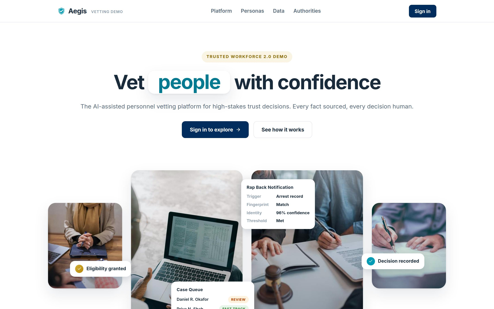
*Figure 1. The deployed demonstration. Everything in this paper is a real screen from a running product, not a mockup.*

### 6.1 One Person, One File

The portal opens on the population, not a queue: pipeline stage counts, an AI risk distribution, and the subjects who need attention first. One click lands on a case file that carries everything the policy says an adjudicator should weigh.

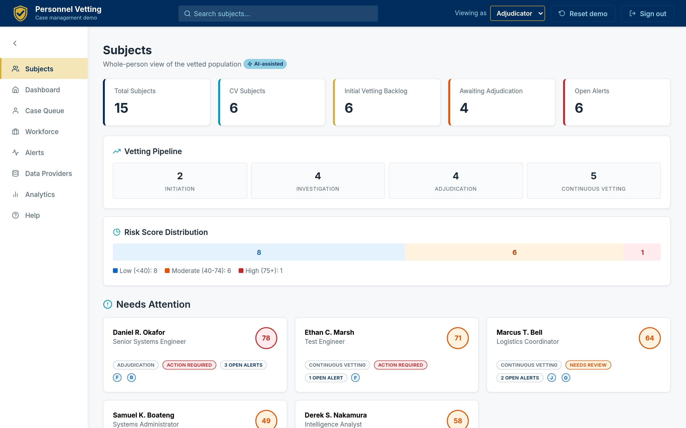
*Figure 2. The Subjects home: population KPIs, the vetting pipeline, and risk posture in one view. On phones the same page reflows to a compact two-across layout.*

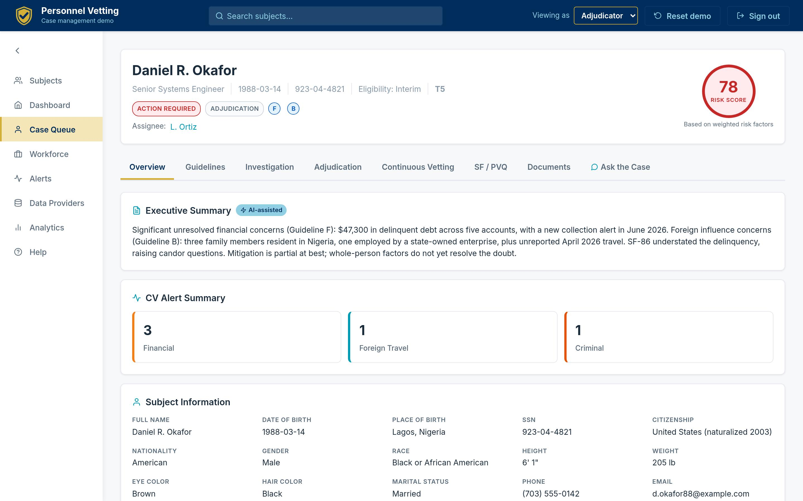
*Figure 3. A case file's Overview tab: an AI executive summary with the case's continuous-vetting alert posture and the complete subject profile beneath it. The header shows status, stage, flagged guidelines, the assigned owner, and a 0-100 risk score.*

The overview alone eliminates the first hour of a cold case review: what is this case, what changed, who owns it, and where does the risk concentrate.

### 6.2 The Whole-Person Worksheet

SEAD-4 paragraph 2(d) lists nine whole-person factors, from the seriousness of the conduct to the potential for duress [16]. Aegis renders them as a working document: an AI-drafted assessment per factor, evidence chips that jump to the alert, record check, or document behind each statement, and adjudicator-only ratings that persist with notes.

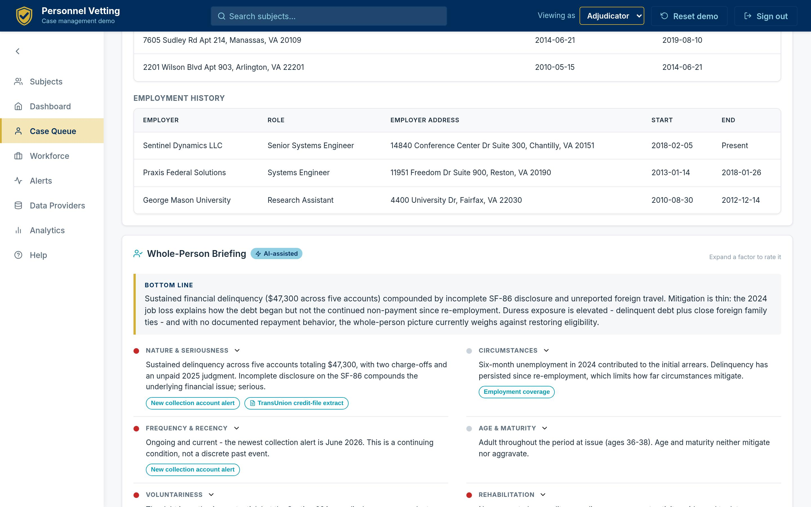
*Figure 4. The Whole-Person Briefing: nine factors, each with a draft assessment and linked evidence, ratable by the adjudicator. The AI drafts; the human rates and decides.*

### 6.3 Guideline Analysis With Real Precedent

For every flagged SEAD-4 guideline, the case file shows the AI assessment, the evidence table with providers and dates, the specific disqualifying and mitigating conditions with Adjudicative Guidelines paragraph citations, and - critically - **real DOHA precedents** retrieved from the 33,610-decision corpus, each linking to the official published decision.

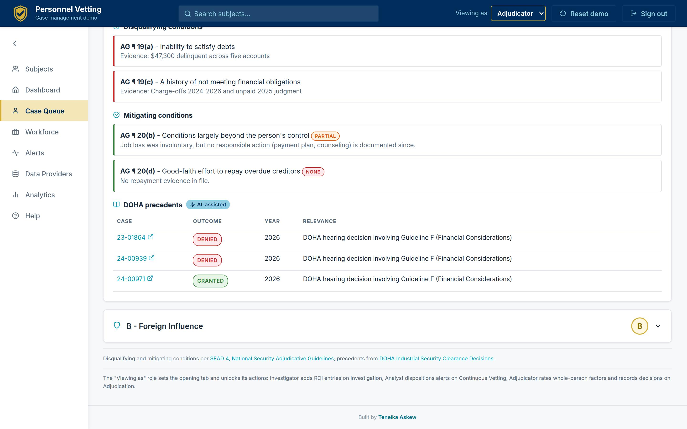
*Figure 5. Guideline F (Financial Considerations) for the demonstration's hero case: AG paragraph 19(a)/19(c) disqualifiers, partially applicable mitigators, and retrieved precedent from the real DOHA corpus.*

The corpus is not decoration. Financial considerations - Guideline F - appear in **20,847 of the 33,610 decisions and carry a 70.8 percent denial rate**; personal conduct (Guideline E) appears in 11,816 with a 78.5 percent denial rate. That is the base-rate context an adjudicator should have at their fingertips when weighing a new financial case, and the same corpus grounds precedent retrieval per fact pattern.

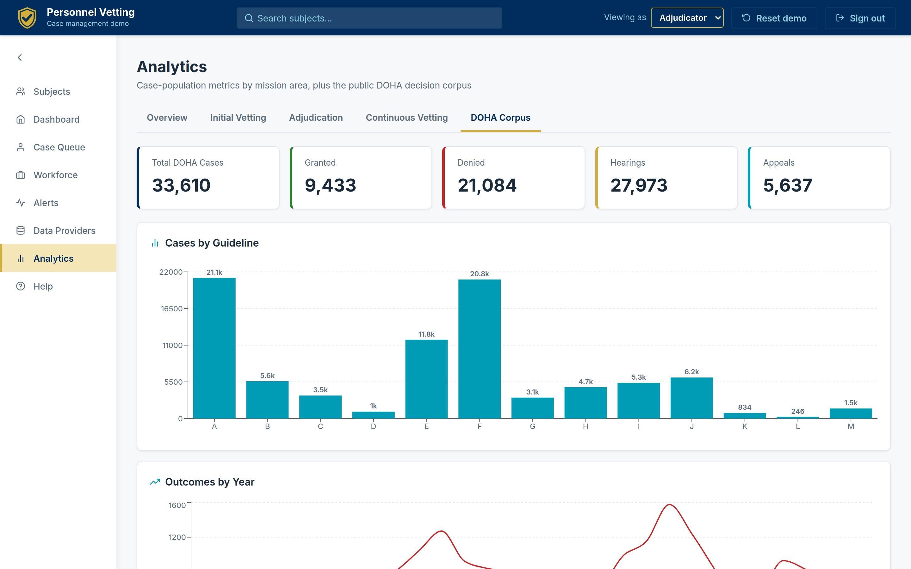
*Figure 6. The DOHA corpus, quantified in-product: 33,610 real decisions by outcome, year, guideline, and case type - the empirical backbone for precedent retrieval and denial-rate context.*

### 6.4 The Questionnaire as Living Evidence

The SF-86 (transitioning to the Personnel Vetting Questionnaire) is the subject's own account - 29 sections of it. Aegis renders the full questionnaire with every answer, and flags precisely where later verification contradicted the subject or where post-submission events changed the picture. Structured answers - relatives, foreign contacts, residences, employment, travel - render as tables, not prose.

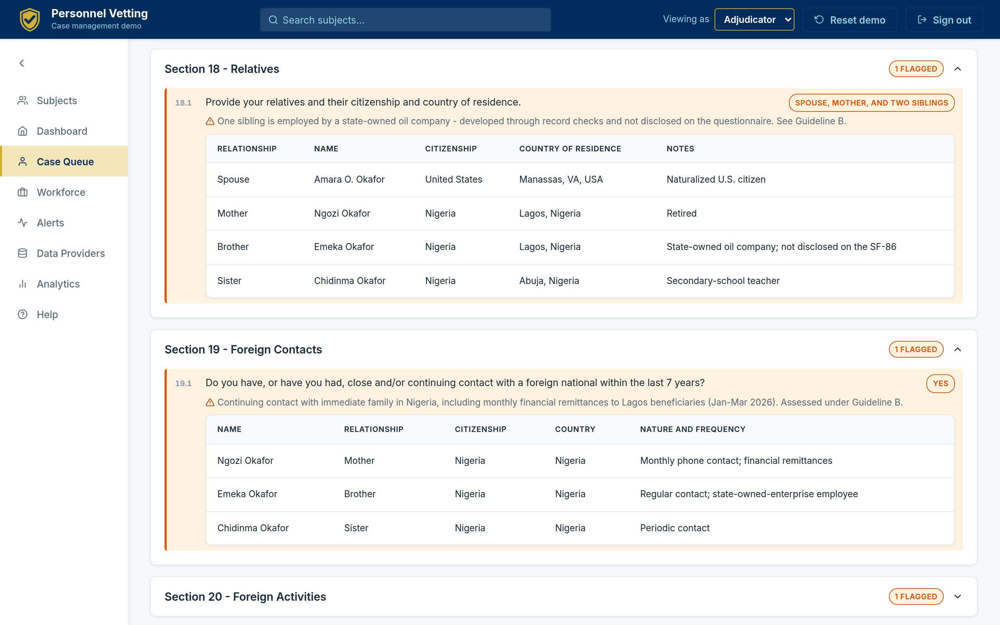
*Figure 7. The questionnaire as evidence: Section 18 relatives and Section 19 foreign contacts, with the specific discrepancy flagged - a sibling's state-owned-enterprise employment developed through record checks but not disclosed. Candor issues become visible, cited, and reviewable.*

This is the discrepancy analysis investigators do by hand today, pre-assembled: self-report on the left of the comparison, matched record on the right, guideline cross-reference attached.

### 6.5 Continuous Vetting Triage That Shows Its Work

DCSA's continuous-vetting analysts run a three-step validation on every alert: confirm the identity match, confirm the data meets investigative-standard thresholds, confirm it was not previously adjudicated [17]. Aegis makes that workflow the screen itself.

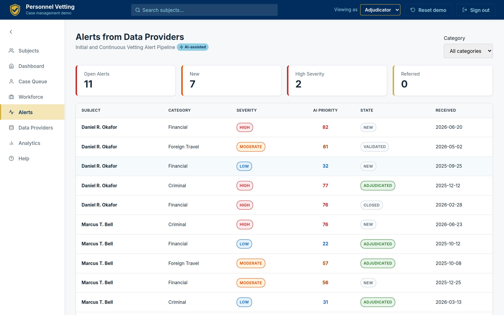
*Figure 8. The global alert inbox: category, severity, AI priority score, and workflow state for every alert from every provider, deep-linking into the owning case.*

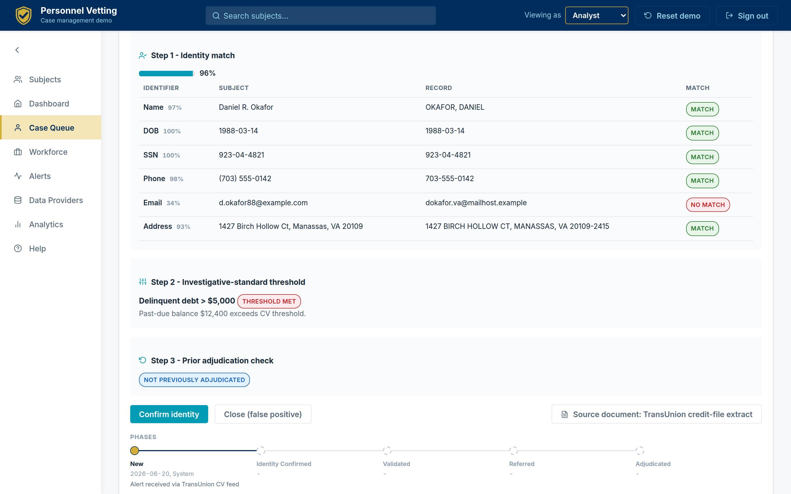
*Figure 9. The three-step validation on one screen: a 96 percent identity match with per-identifier scoring (note the email mismatch caught explicitly), the threshold rule the alert met, the prior-adjudication check, disposition actions, and the alert's full workflow history.*

This single screen is the strongest argument for the experience layer. Every element on it exists somewhere in today's enterprise - the identifiers, the threshold rules, the adjudication history, the source document. No screen in today's enterprise puts them together. The result is triage that is faster *and* audit-ready: the analyst's basis for confirming or closing is captured as structure, not tribal knowledge.

### 6.6 Documents With Provenance

Every document in a case file - police reports, credit-file extracts, suspicious activity reports, Rap Back notifications, travel records, ROIs, and real DOHA decisions - opens as a paper facsimile beside its extracted, structured data, with the provider and receipt date attached.

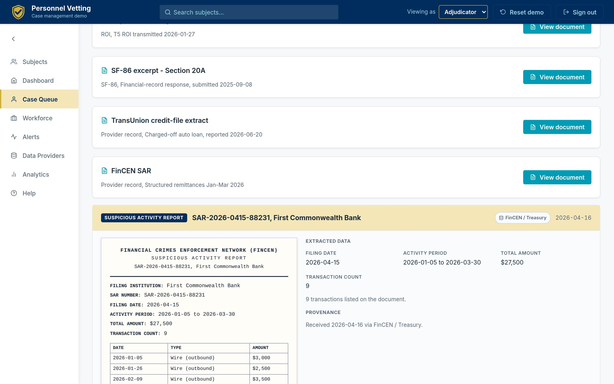
*Figure 10. A FinCEN SAR rendered as a letterhead facsimile beside its extracted fields and transactions. Reviewers see the document as it exists and the data as the system understands it - one click from the alert it substantiates.*

### 6.7 Ask the Case

Every case file carries a scoped assistant that answers questions **from the file alone** - retrieval over the case's own evidence with citations back to the guideline analysis, documents, and history that support each answer. It runs deterministically offline and can be grounded through a live model when configured; either way it cannot answer beyond the file.

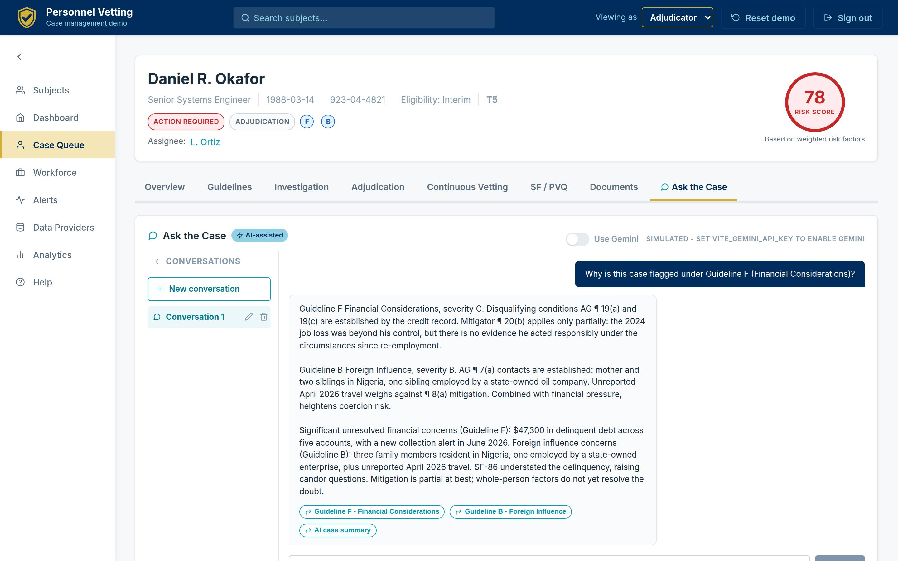
*Figure 11. Ask the Case: a new reviewer asks why the case is flagged under Guideline F and gets a cited answer assembled from the file - AG paragraphs, amounts, dates - with jump links to the underlying sections.*

For onboarding a transferred case, preparing a hearing, or answering an oversight query, this converts hours of file review into a conversation - without ever letting the AI leave the record.

### 6.8 The Data Provider Fabric

The layer is only as good as its feeds, so Aegis treats providers as first-class citizens: a 12-source registry - FBI CJIS/NCIC and Rap Back, the three credit bureaus, LexisNexis, FinCEN, CBP I-94, courts, DMV, IRS, SEAD-5 social media, DISS - modeling more than 436 million records, with health, sync cadence, coverage-by-guideline, and per-provider drill-downs connecting every alert and record check back to its source.

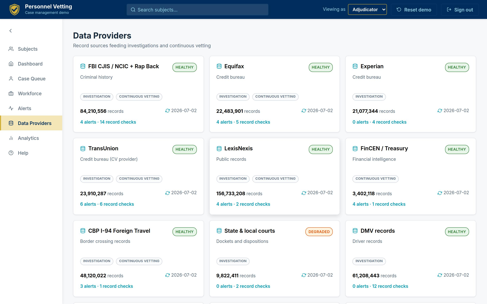
*Figure 12. The provider registry with a provider-to-guideline coverage matrix: which sources inform which of the thirteen SEAD-4 guidelines, and how healthy each feed is right now.*

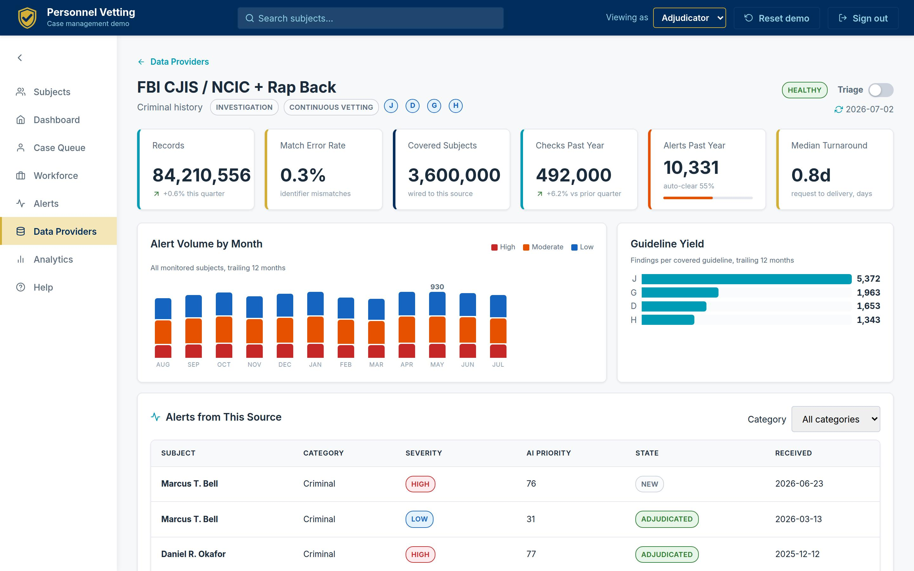
*Figure 13. A provider drill-down: records, match-error rate, network-wide check volume and findings, turnaround, and every alert and record check this source delivered into live cases.*

When a feed degrades - and feeds degrade - the security office sees it as an operations dashboard, not as a mystery of missing alerts.

### 6.9 Workforce and Assignment

Vetting is a workforce business. Aegis includes an assignment layer modeled on an investigative workflow application: a roster of investigators, analysts, and adjudicators - federal and contractor - with capacity, live utilization, median turnaround, and on-time performance; a manager persona; and **recommendation-ranked assignment** that scores eligible staff on specialty fit, tier authorization, spare capacity, turnaround history, and location, with a plain-language rationale for each recommendation.

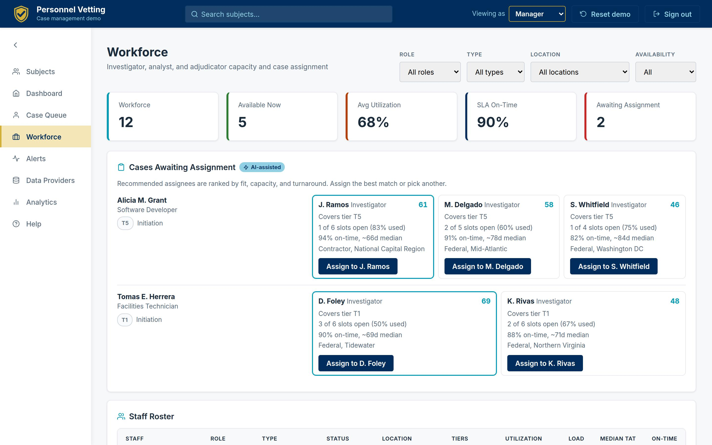
*Figure 14. The Workforce view as a manager sees it: capacity KPIs, cases awaiting assignment with ranked recommendations and reasons, and the full roster with utilization bars and SLA performance. Assigning a case routes it into the assignee's queue instantly.*

This is the operational blind spot of Section 3 made visible: who can take this case, who is drowning, and who reliably closes this case type inside the timeline - answered by data instead of memory.

### 6.10 Command View, Anywhere

Population analytics roll the whole enterprise up - risk posture, aging, guideline flags, adjudication levels, timeliness against targets - and the entire product is responsive down to a phone, where KPIs compact, large numbers abbreviate, and navigation collapses behind a drawer.

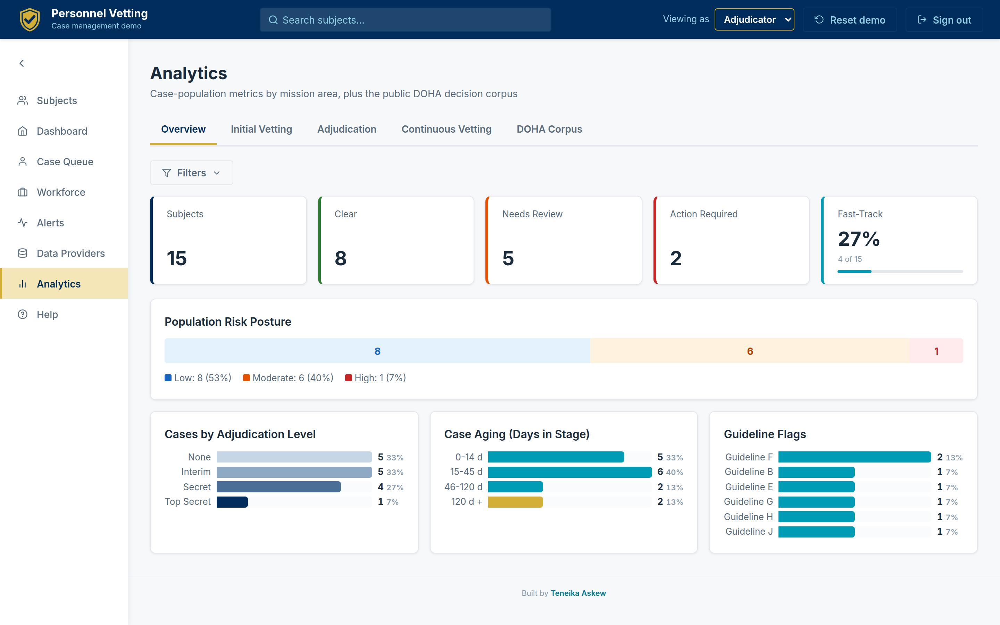
*Figure 15. Population analytics: risk posture, case aging, adjudication levels, and guideline flags - the roll-up a program office presents without building slides.*

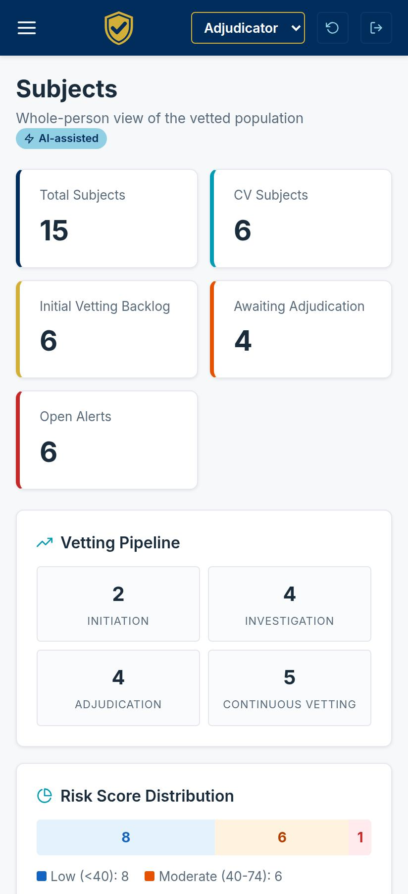

*Figure 16. The same product on a phone: leadership visibility does not wait for a desk.*

### What It Took to Build

The uncomfortable fact for multi-year programs: this reference implementation - all sixteen figures above - went from design research to a deployed product in roughly **two weeks** of iterative delivery, with a corpus pipeline that parsed 33,610 real decisions, a typed data layer validated by 42 data tests, 197 frontend tests, end-to-end smoke and responsive suites, and continuous deployment on every merge. It is a demonstration, not an accredited system - but it prices the experience-layer pattern honestly: **weeks and a small team, not years and a program office**.

---

## 7. The Hardest Problem: Signal Quality at Scale

Any team can render dashboards. The center of gravity in vetting operations is **signal quality**: with roughly 4 million people enrolled in continuous vetting [12], even small false-positive rates translate into analyst-years of wasted triage, and false negatives are mission failures.

The experience layer attacks signal quality in three specific, screen-visible ways:

- **Identity resolution as evidence, not magic.** Figure 9's per-identifier scorecard - name, DOB, SSN, phone, email, address, each scored and matched independently - turns a black-box match confidence into something an analyst can interrogate and override. A mismatched email that would silently torpedo trust in a monolithic score is instead an explicit, visible discrepancy.
- **Thresholds as first-class rules.** Every alert shows the investigative-standard rule it met ("delinquent debt over $5,000") beside the actual value. Analysts stop re-deriving why an alert exists; oversight can audit thresholds against the standards.
- **Prior-adjudication deduplication.** The third validation step - was this already adjudicated? - is checked against the subject's history and honored across the file, cutting duplicate work and honoring reciprocity (SEAD-7) by design.

The measurable consequence in the demonstration's workflow model: alert triage that requires opening four to six systems collapses to a single screen with a three-action disposition. Applied to DCSA-scale volumes, every minute shaved from average triage is on the order of **tens of thousands of analyst-hours per year** returned to the mission.

---

## 8. Built to Sit on Top: Integration Architecture

The demonstration makes an architectural argument that matters more than any single screen: **the entire product runs on typed, versioned data contracts, not on any particular back end.**

- **A canonical provider registry.** Every alert, record check, and document joins to providers by canonical ID - never by name matching. Swapping a demonstration feed for a live NBIS, DISS, or commercial API changes the adapter, not the application.
- **Typed contracts at every boundary.** Roughly 45 validated data models define subjects, cases, alerts, checks, documents, staff, and analytics. In the demonstration those contracts are generated files; in production the same contracts are API responses. The UI cannot tell the difference - which is the point.
- **Role assertion at the edge.** Views are gated by role (investigator, analyst, adjudicator, manager), so the layer can serve as the whole-person view *inside* multiple consuming systems: an investigation platform asserts the investigator role, an adjudication platform asserts the adjudicator role, and both render the same governed subject file with role-appropriate defaults and actions.
- **Additive, reversible adoption.** Because the layer only reads systems of record and writes its own workflow state, an agency can pilot it beside existing tools, scope it to one population or mission, and expand or retire it without migration risk. It is compatible with - not competitive with - NBIS: whenever enterprise capabilities arrive, the layer consumes them as one more provider.

This is the same "system of engagement over systems of record" pattern that transformed commercial customer operations, applied to a domain where the systems of record are, by GAO's account, going to be in transition into FY2028 [6][7].

---

## 9. What It Is Worth: A Value Model

The value case does not depend on heroic assumptions. It compounds from four mundane ones. The model below is illustrative - the assumptions are stated so an agency can substitute its own volumes - and uses a mid-size cleared population of 100,000 with a $120,000 fully loaded analyst/adjudicator cost ($58/hour).

| Value lever | Baseline assumption | With experience layer | Annual value (illustrative) |
|---|---|---|---|
| CV alert triage | 20,000 alerts/yr at 45 min each (swivel-chair across systems) | 15 min with single-screen 3-step validation | ~10,000 hours ≈ **$580K** |
| Clean-case review | 8,000 initial cases/yr; 60% clean; 2.0 hrs file assembly and review each | 0.5 hrs with pre-assembled whole-person file and fast-track flagging | ~7,200 hours ≈ **$418K** |
| Issue-case preparation | 3,200 issue cases/yr; 3 hrs assembling evidence, precedent, and drafting | 1.5 hrs with guideline-cited evidence, retrieved precedent, drafted SOR starting point | ~4,800 hours ≈ **$278K** |
| Assignment and load balancing | 5% of cases mis-queued or idle 10+ days awaiting assignment | Recommendation-ranked assignment against live capacity | ~400 cases/yr unstalled; **timeliness risk avoided** |

Direct labor alone: on the order of **$1.2-1.5 million per year per 100,000 cleared population**, before the second-order effects - and the second-order effects are larger:

- **Time-to-mission.** Cleared professionals now command record compensation - average total compensation reached **$126,125 in 2025** [24] - and INSA estimated that cleared contractor talent idled by clearance-process delays costs about **$2 billion a year in the intelligence community alone, roughly $8 billion government-wide**, with about 10 percent of the cleared contractor workforce awaiting clearance actions at any time [23]. The government's own scorecard shows what process acceleration is worth: preliminary determinations saved an average of **132 days per case** across 144,000+ favorable determinations in FY2025 [20]. Every day the layer removes from triage and file assembly comes straight out of that tail.
- **Risk surfaced earlier - and priced attractively.** Continuous vetting finds problematic behavior three to seven years sooner than the reinvestigation cycle [13][20], and it is cheap: at FY2026 rates, a full T5 investigation runs **$5,890-$6,361** while a year of continuous vetting costs about **$40-$92 per enrollee** [21]. The economics already reward catching issues in-stream; triage capacity is the constraint, and hours returned to analysts are hours applied to the alerts that matter.
- **Insider risk, quantified.** The 2026 Ponemon/DTEX study puts the average annual cost of insider risk at **$19.5 million per organization**, with 67-day average containment - and organizations with dedicated insider-risk programs avoided about $8.2 million a year of it [25]. A triage-capable, whole-person operating picture is the personnel-security half of that program.
- **Audit and due-process resilience.** Structured validation trails and provenance-carrying evidence cut the cost of oversight responses, appeals, and the data-quality failures GAO flagged in December 2025 - where **86 percent of the timeliness statistics GAO analyzed were inaccurate** [8].
- **Program-risk hedge.** Every capability in this paper is additive to the enterprise roadmap. The layer de-risks the wait for NBIS rather than betting against it.

---

## 10. Trust, Governance, and Due Process

In this domain, governance is not a compliance section at the back of the deck; it is the buying decision. The reference implementation was built to make the governance argument visible:

- **Human decision authority, structurally.** AI in the product prioritizes, drafts, and organizes; it cannot disposition an alert, rate a whole-person factor, or record a determination. Those actions belong to roles, and every AI surface carries the same label. This is the posture OMB's governing AI policy (M-25-21, April 2025) requires for high-impact uses [26] - and the direction the mission owner has already set. DCSA's June 2026 strategic plan commits to at least ten AI initiatives in production by the second quarter of FY2027, framed exactly this way: technology and data accelerate the work; **people own every trust decision** [27]. The experience layer is that policy, rendered as screens.
- **Authority-anchored UI.** Nearly every card in the product cites its governing authority - SEAD-3 reporting, SEAD-4 guidelines and whole-person factors, SEAD-5 social media, SEAD-6 continuous vetting, SEAD-7 reciprocity, the Federal Investigative Standards, FCRA for consumer credit data, the Privacy Act [16][17]. Practitioners audit the screen against the standard without leaving it.
- **Provenance and auditability.** Every evidence object carries provider, date, and scope; every workflow action lands in a visible history. The Statement of Reasons that ends a case can cite its way back to source.
- **Privacy by construction.** The demonstration proves the pattern with zero real PII - fictional identities enforced by automated tests - and the production pattern confines PII handling to the governed data layer under agency-controlled access, aligned to Privacy Act and FCRA obligations.
- **A path to accreditation.** As a read-mostly layer over accredited systems of record, the boundary is small and well-defined - an intentionally easier ATO conversation than a new system of record, and a candidate for existing FedRAMP/IL-hosted infrastructure.

---

## 11. What Leaders Can Do Now

Six moves, sequenced so the first three fit inside 90 days.

1. **Pick one population and one pain.** Start where the swivel-chair tax is worst - typically CV alert triage or adjudication case preparation for a single directorate or facility population.
2. **Stand up the read-only file.** Aggregate the subject file - questionnaire, checks, alerts, documents - from existing exports and feeds behind typed contracts. No writes, no workflow, no migration. This is the 90-day pilot, and the reference implementation prices it: weeks, not quarters.
3. **Instrument the baseline.** Measure triage minutes, file-assembly hours, and assignment latency before turning anything on. The value model in Section 9 becomes your model with real denominators.
4. **Add the three-step triage screen.** The first write-capability should be the alert validation workflow - highest volume, clearest audit payoff, and the screen practitioners ask for first.
5. **Bring the workforce into view.** Roster, capacity, and recommendation-ranked assignment convert management from memory to measurement - and give leadership the utilization picture that budget season always asks for.
6. **Negotiate the enterprise hand-off in advance.** Define which capabilities the layer cedes to NBIS as enterprise increments land, and which remain agency-differentiated. The layer should be a bridge with a published toll schedule, not a bet against the program.

---

## 12. The Imperative

The policy reform already happened. Trusted Workforce 2.0 changed what the government promises about trust: continuous, whole-person, evidence-based. What has not happened - after eight years and billions of dollars - is the working surface where practitioners can keep that promise. GAO's numbers say the enterprise system will keep arriving in increments through FY2028 [6][7]. The mission does not get to wait that long, and it does not have to.

The experience layer is not a moonshot. It is an aggregation pattern with a governance spine, and this paper's figures show it running: one person, one file; every claim traceable; AI assisting and humans deciding; the workforce visible; the whole thing built in weeks on top of - not instead of - the systems the government already owns.

The agencies that move first will not just process cases faster. They will be the ones whose analysts spend their hours on the alerts that matter, whose adjudicators decide from the whole record, and whose leadership answers oversight from a screen instead of a scramble.

**Trust, at mission speed. The tooling is no longer the excuse.**

---

## About This Paper and the Data

This paper pairs verified public-record research with a working demonstration. Federal program facts and statistics are drawn from the primary sources cited below - GAO reports and testimony, performance.gov, DCSA publications, and congressional records - each verified against the source in July 2026. Product capabilities are described as built and are shown in unretouched screenshots of the deployed demonstration. Product-derived figures (corpus composition, denial rates by guideline, provider registry scale, test counts, build timeline) are measured from the demonstration's committed dataset and repository history.

The demonstration itself is educational: all subject identities are fictional by construction (900-series SSNs, reserved 555 telephone numbers, example-domain email addresses, enforced by automated tests); precedents and analytics derive from published DOHA decisions, which are public records; no DoD, DCSA, or DOHA endorsement is implied. The Section 9 value model is illustrative and parameterized so agencies can substitute their own volumes.

## Sources

1. GAO-18-431T, *Personnel Security Clearances: Additional Actions Needed to Ensure Quality, Address Timeliness, and Reduce Investigation Backlog* (March 2018). https://www.gao.gov/products/gao-18-431t
2. GAO, *GAO Adds Government-wide Personnel Security Clearance Process to High-Risk List* (January 25, 2018). https://www.gao.gov/press-release/gao-adds-government-wide-personnel-security-clearance-process-high-risk-list
3. GAO-25-108125, *High-Risk Series* (February 2025). https://www.gao.gov/products/gao-25-108125
4. GAO-23-105670, *Personnel Vetting: DOD Needs a Reliable Schedule and Cost Estimate for the National Background Investigation Services Program* (August 2023). https://www.gao.gov/products/gao-23-105670
5. GAO-24-107616, *DOD Personnel Vetting: DOD Needs to Improve Management of the NBIS Program* (June 2024). https://www.gao.gov/products/gao-24-107616
6. GAO-25-108721, *DOD Personnel Vetting: Sustained Leadership Is Critical to DOD's New Approach* (September 2025). https://www.gao.gov/products/gao-25-108721
7. GAO-26-108838, *DOD Personnel Vetting: Leadership Attention Needed to Prioritize System Development* (testimony, February 24, 2026). https://www.gao.gov/products/gao-26-108838
8. GAO-26-107100, *Personnel Security Clearances: Actions Needed to Address Significant Data Reliability Issues* (December 2025). https://www.gao.gov/products/gao-26-107100
9. House Committee on Oversight and Accountability, *Hearing Wrap Up: DOD Says Security Clearance Process Updates Are "Unacceptably Late"* (June 2024). https://oversight.house.gov/release/hearing-wrap-up-dod-says-security-clearance-process-updates-are-unacceptably-late/
10. DCSA, *Introduction to NBIS eApp*; ISOO Overview, *DCSA Memorandum Details Transition to NBIS eApp* (2023). https://www.dcsa.mil/About-Us/News/Article/Article/3156526/introduction-to-nbis-eapp/
11. Performance.gov, *DOD - Defense Counterintelligence and Security Agency (service provider profile)*. https://www.performance.gov/agencies/dod/service-providers/dod-dcsa/
12. DCSA, *Personnel Security Mission Fact Sheet* (January 2025). https://www.dcsa.mil/Portals/128/Documents/about/err/DCSA-Mission%20Fact%20Sheet-PS_Jan2025_vFinal.pdf
13. GAO-25-107325, *Personnel Vetting: Actions Needed to Implement Reforms* (2025); Performance.gov, *Trusted Workforce 2.0*. https://www.gao.gov/products/gao-25-107325 and https://www.performance.gov/trusted-workforce/
14. Federal News Network, *How NBIB slashed the security clearance backlog* (June 2019); *DCSA backlog of security clearance investigations down 24%* (May 2025). https://federalnewsnetwork.com/defense-main/2025/05/dcsa-backlog-of-security-clearance-investigations-down-24/
15. Trusted Workforce Policy Index. https://assets.performance.gov/files/Trusted_Workforce_Policy_Index.pdf
16. ODNI, *Security Executive Agent Directive 4: National Security Adjudicative Guidelines*. https://www.dni.gov/files/NCSC/documents/Regulations/SEAD-4-Adjudicative-Guidelines-U.pdf
17. DCSA, *Continuous Vetting*. https://www.dcsa.mil/Personnel-Vetting/Continuous-Vetting/
18. ODNI, *SEAD-5: Collection, Use, and Retention of Publicly Available Social Media Information*. https://www.odni.gov/files/NCSC/documents/Regulations/SEAD_5.pdf
19. DOHA, *Industrial Security Clearance Decisions* (published hearing and appeal decisions). https://doha.ogc.osd.mil/Industrial-Security-Program/
20. Performance Accountability Council, *Trusted Workforce 2.0 Quarterly Progress Report, FY2026 Q1*. https://assets.performance.gov/files/FY26_Q1_Personnel_Vetting_QPR.pdf
21. DCSA, *FIN 24-01: FY2025 and FY2026 Background Investigation and Continuous Vetting Billing Rates* (August 2024). https://www.dcsa.mil/Portals/128/Documents/about/err/FIN_24-01_FY25_and_FY26_Billing_Rates.pdf
22. ClearanceJobs, *How Long Does It Take to Get a Clearance? Q1 2026 Update* (March 2026). https://news.clearancejobs.com/2026/03/19/how-long-does-it-take-to-get-a-clearance-q1-2026-update/
23. INSA, *Security Clearance Reciprocity: Obstacles and Opportunities* (June 2019). https://www.insaonline.org/docs/default-source/default-document-library/2022-white-papers/security-clearance-reciprocity-obstacles-and-opportunities.pdf
24. ClearanceJobs, *2026 Security Clearance Compensation Report* (March 2026). https://about.clearancejobs.com/employers/recruiting-resources/2025-security-clearance-compensation-survey
25. Ponemon Institute / DTEX Systems, *2026 Cost of Insider Risks Global Report* (February 2026). https://ponemon.dtex.ai/
26. OMB, *M-25-21: Accelerating Federal Use of AI through Innovation, Governance, and Public Trust* (April 3, 2025). https://www.whitehouse.gov/omb/information-resources/guidance/memoranda/
27. ClearanceJobs, *DCSA's New Strategic Plan Puts Delivery Deadlines on Security Clearance Modernization* (June 2026). https://news.clearancejobs.com/2026/06/23/dcsas-new-strategic-plan-puts-delivery-deadlines-on-security-clearance-modernization/

## Contact

**Teneika Askew** - [linkedin.com/in/teneikaaskew](https://www.linkedin.com/in/teneikaaskew)

To see the demonstration live or discuss a scoped pilot against your agency's population and systems, reach out directly.
